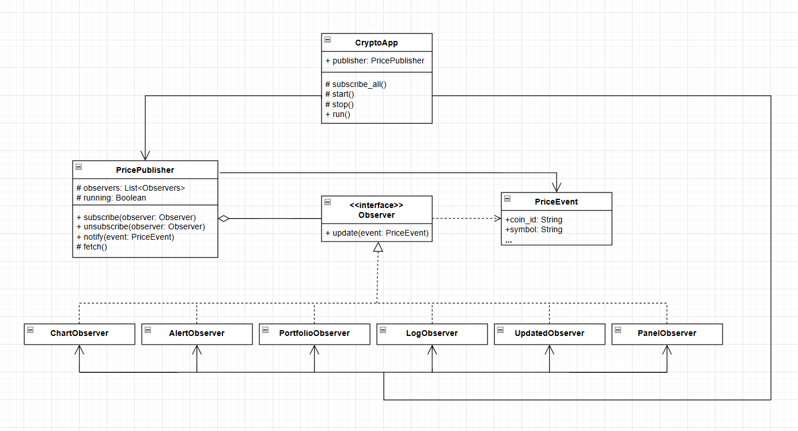

# Отчёт по лабораторной работе №3
## Поведенческие паттерны проектирования

**Тема:** Реализация паттерна «Наблюдатель» на языке Python для разработки криптовалютного трекера в реальном времени

---

## 1. Цель работы

- Изучить теоретические основы поведенческих паттернов проектирования, в частности паттерна «Наблюдатель».
- Научиться разделять источник данных (издатель) и потребителей данных (наблюдатели) через абстрактный интерфейс.
- Реализовать систему с несколькими независимыми компонентами, реагирующими на единый поток событий в реальном времени.
- Закрепить навыки работы с многопоточностью (`threading`), абстрактными классами, датаклассами и сторонними API.
- Провести сравнительный анализ архитектурного подхода с паттерном и без него на одном и том же функционале.

---

## 2. Описание предметной области

В рамках данной работы разработан графический криптовалютный трекер «КРИПТОМИЛЛИОНЕРЫЧ». Программа получает рыночные данные от публичного API в реальном времени и отображает их одновременно в нескольких независимых виджетах интерфейса. Предметная область характеризуется следующими факторами:

| Фактор | Описание |
|---|---|
| **Множество потребителей** | Одни и те же ценовые данные нужны графику, алертам, портфелю, логу и панели цены одновременно |
| **Асинхронность** | Данные поступают из фонового потока, а обновление интерфейса должно происходить строго в главном потоке `tkinter` |
| **Независимость компонентов** | График, алерты и портфель не должны знать друг о друге и не должны влиять на получение данных |
| **Масштабируемость** | Добавление нового виджета не должно требовать изменений в логике получения данных |

---

## 3. Решение: применение паттерна «Наблюдатель»

Для решения задачи был выбран паттерн **Наблюдатель**. Он позволяет организовать слабосвязанную систему, в которой издатель рассылает события всем зарегистрированным подписчикам, не зная ничего об их конкретной реализации.

В проекте паттерн реализован следующим образом:

- **Разделение ответственности** - класс `PricePublisher` отвечает исключительно за получение данных от API и их рассылку. Вся бизнес-логика (отрисовка, расчёт, логирование) находится в наблюдателях.
- **Единый объект события** - данные упаковываются в `@dataclass PriceEvent`, который передаётся каждому подписчику. Добавление нового поля требует изменения только одного класса.
- **Абстрактный интерфейс** - все наблюдатели наследуют базовый класс `Observer` с методом `update()`, что позволяет издателю работать с любым подписчиком через единый интерфейс.
- **Потокобезопасность** - фоновый поток передаёт управление в главный поток `tkinter` через `root.after(0, ...)`, гарантируя корректное обновление виджетов.

---

## 4. Архитектура приложения

### 4.1. Диаграмма классов



### 4.2. Роли классов

| Класс / Структура | Роль в паттерне | Описание |
|---|---|---|
| `PriceEvent` | Объект события | `@dataclass`-контейнер с данными: цена, символ, объём, капитализация, метка времени |
| `Observer` | Абстрактный наблюдатель | Базовый класс с абстрактным методом `update(event)`. Гарантирует единый интерфейс у всех подписчиков |
| `PricePublisher` | Издатель | Управляет списком `_observers`, запрашивает API в фоновом потоке и рассылает события через `notify()` |
| `ChartObserver` | Конкретный наблюдатель | Накапливает историю цен и перерисовывает линейный график `matplotlib` при каждом событии |
| `AlertObserver` | Конкретный наблюдатель | Проверяет пороговые условия, заданные пользователем, и фиксирует срабатывания с временной меткой |
| `PortfolioObserver` | Конкретный наблюдатель | Пересчитывает стоимость портфеля и итог сессии при каждом обновлении цены |
| `LogObserver` | Конкретный наблюдатель | Ведёт хронологическую ленту всех ценовых тиков с цветовым выделением направления движения |
| `PanelObserver` | Конкретный наблюдатель | Обновляет текстовые лейблы с текущей ценой и изменением за сессию в левой панели интерфейса |
| `CryptoApp` | Клиент / сборщик | Создаёт издателя и всех наблюдателей, регистрирует их через `publisher.subscribe()` в `_subscribe_all()` |

### 4.3. Детальное описание реализации

#### Класс `Observer` (абстрактный интерфейс)

Базовый класс, от которого наследуют все шесть конкретных наблюдателей. Метод `update()` намеренно вызывает `NotImplementedError` - это гарантирует, что каждый наследник обязан реализовать его самостоятельно.

```python
class Observer:
    def update(self, event: PriceEvent) -> None:
        raise NotImplementedError
```

#### Класс `PricePublisher` (издатель)

Единственный класс в программе, который обращается к сети. Хранит список подписчиков в `_observers`. Метод `notify()` - ядро паттерна: простой цикл по списку, вызывающий `update()` у каждого. Издатель не знает и не должен знать, что происходит внутри каждого `update()`.

```python
def notify(self, event: PriceEvent) -> None:
    for obs in self._observers:
        obs.update(event)  # издатель не знает, кто это
```

#### Метод `_subscribe_all()` в `CryptoApp`

Единственное место в программе, где издатель узнаёт о существовании конкретных наблюдателей. Добавление нового компонента требует только двух строк здесь - и никаких изменений в `PricePublisher`.

```python
self._btc_chart = ChartObserver(self.btc_chart_frame, "bitcoin", "BTC")
self.publisher.subscribe(self._btc_chart)  # вот и вся регистрация
```

---

## 5. Вывод и сравнительный анализ

### 5.1. Сравнение подходов

| Характеристика | Без паттерна (монолит) | С паттерном Наблюдатель |
|---|---|---|
| **Добавление компонента** | Редактировать `_on_price_update()`, добавлять явный вызов | Создать класс-наследник `Observer`, добавить две строки в `_subscribe_all()` |
| **Связанность** | Высокая: `CryptoApp` знает каждый компонент по имени и методу | Низкая: `PricePublisher` знает только абстрактный интерфейс `Observer` |
| **Добавление поля в событие** | Менять `_fetch()`, `_on_price_update()` и каждый компонент | Менять только `PriceEvent` и одно место в `_fetch()` |
| **Центральный метод** | Монолитный: явно перечисляет каждый компонент | `notify()` - три строки цикла, которые никогда не меняются |
| **Тестируемость** | Сложно: компоненты жёстко связаны через `CryptoApp` | Просто: каждый `Observer` тестируется изолированно |

### 5.2. Ключевое отличие в коде

**Вариант 1 - без паттерна** (центральный обработчик знает о каждом компоненте):

```python
def _on_price_update(self, coin_id, symbol, price, change_24h, volume, market_cap, timestamp):
    chart.draw(price, timestamp)
    self._alerts.check(coin_id, symbol, price, timestamp)
    self._portfolio.recalculate(coin_id, price, timestamp)
    self._log.write(coin_id, symbol, price, timestamp)
    self._update_panel(coin_id, symbol, price, volume, market_cap)
    # добавить новый компонент = прийти сюда и дописать строку
```

**Вариант 2 - с паттерном Наблюдатель:**

```python
def notify(self, event: PriceEvent) -> None:
    for obs in self._observers:
        obs.update(event)  # этот метод не меняется никогда
```

Издатель не знает ничего о получателях. Этот метод не изменится ни при добавлении нового компонента, ни при удалении существующего.

---

## 6. Заключение

В ходе работы был разработан графический криптовалютный трекер с применением паттерна «Наблюдатель». Для наглядной демонстрации преимуществ паттерна параллельно реализована версия без него на том же функционале. Использование данной архитектуры позволило:

- **Изолировать логику получения данных от логики их отображения**, что соответствует принципу единственной ответственности (SRP).
- **Устранить жёсткую связанность**: издатель `PricePublisher` не имеет зависимостей ни от одного конкретного виджета.
- **Обеспечить расширяемость системы**: добавление нового компонента не требует изменений в существующем коде издателя.
- **Корректно решить задачу межпоточного взаимодействия**: данные получаются в фоновом потоке и безопасно передаются в главный поток через механизм `root.after()`.

> **Итог:** паттерн «Наблюдатель» доказал свою эффективность для систем с одним источником данных и множеством независимых потребителей, где состав потребителей может меняться в процессе разработки.
