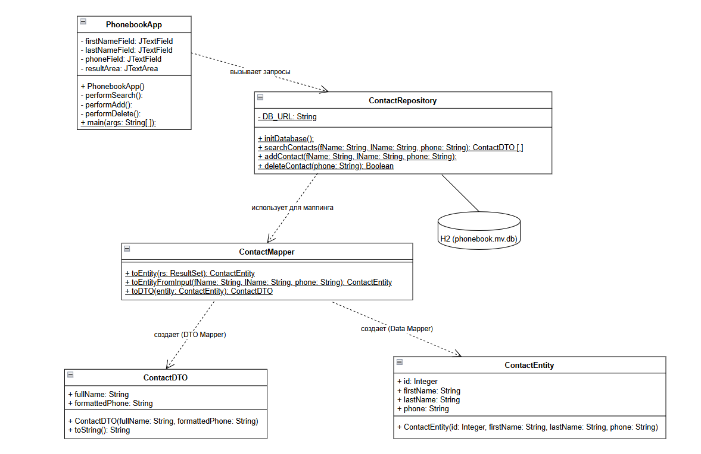

# Отчёт по лабораторной работе №4
## Структурные паттерны проектирования

**Тема:** Реализация паттерна «Mapper» на языке Java для организации доступа к данным в приложении «Телефонный справочник»

---

## 1. Цель работы

- Изучить теоретические основы структурных паттернов проектирования, в частности паттерна «Mapper».
- Научиться разделять слои приложения: представление, бизнес-логика и доступ к данным.
- Реализовать систему преобразования данных между форматом базы данных и форматом, пригодным для отображения пользователю.
- Закрепить навыки работы с JDBC, встраиваемой базой данных H2 и графическим интерфейсом Swing.
- Провести сравнительный анализ архитектуры приложения при использовании паттерна и без него.

---

## 2. Описание предметной области

В рамках данной работы рассматривается разработка приложения «Телефонный справочник». Программа позволяет пользователю искать, добавлять и удалять контакты (имя, фамилия, номер телефона). Данные хранятся в локальной базе данных H2 и сохраняются между перезапусками приложения. Предметная область характеризуется следующими факторами:

| Фактор | Описание |
|---|---|
| **Разнородность данных** | Объект в базе данных содержит технический первичный ключ `id`, который не нужен пользователю, но необходим для работы БД |
| **Форматирование** | Данные из БД хранятся в «сыром» виде, а для отображения требуют преобразования: склейки полей, добавления иконок и т.д. |
| **Изоляция слоёв** | Графический интерфейс не должен ничего знать про SQL, ResultSet и устройство базы данных |
| **Гибкость** | При изменении структуры БД или правил отображения не должны требоваться правки по всему коду |

---

## 3. Решение: применение паттерна «Mapper»

Для организации доступа к данным был выбран паттерн **Mapper** (Преобразователь данных). Он позволяет полностью изолировать слой базы данных от слоя представления, обеспечив однозначное и централизованное преобразование объектов между слоями.

В проекте паттерн реализован следующим образом:

- **Разделение ответственности** - данные из базы данных (включая технический `id`) инкапсулируются в классе `ContactEntity`, а объект для передачи на экран - в классе `ContactDTO`, который содержит только отформатированную информацию для пользователя.
- **Централизованное преобразование** - весь код конвертации сосредоточен в классе `ContactMapper`. Три его статических метода отвечают за перевод из `ResultSet` → `Entity`, из пользовательского ввода → `Entity`, и из `Entity` → `DTO`.
- **Защита от SQL-инъекций** - слой репозитория (`ContactRepository`) использует `PreparedStatement`, полностью изолируя бизнес-логику от деталей SQL-запросов.

---

## 4. Архитектура приложения

### 4.1. Диаграмма классов



---

### 4.2. Роли классов

| Класс / Структура | Роль | Описание |
|---|---|---|
| `ContactEntity` | Доменная сущность | Точная копия строки из БД, хранит `id`, `firstName`, `lastName`, `phone` |
| `ContactDTO` | Объект передачи данных | Содержит только форматированные поля для экрана: `fullName`, `formattedPhone` |
| `ContactMapper` | Преобразователь (Mapper) | Единственное место в коде, где происходит конвертация между Entity и DTO |
| `ContactRepository` | Репозиторий | Выполняет SQL-запросы, возвращает готовые DTO, скрывая детали работы с БД |
| `PhonebookApp` | Представление | Графический интерфейс на Swing, не знает ничего про SQL и структуру БД |

### 4.3. Детальное описание реализации

#### Класс `ContactEntity` (доменная сущность)

Является точным отражением строки из таблицы `contacts`. Содержит все поля, включая технический первичный ключ `id`, который не показывается пользователю.

```java
static class ContactEntity {
    public int id;
    public String firstName;
    public String lastName;
    public String phone;

    public ContactEntity(int id, String firstName, String lastName, String phone) {
        this.id = id;
        this.firstName = firstName;
        this.lastName = lastName;
        this.phone = phone;
    }
}
```

#### Класс `ContactDTO` (объект передачи данных)

Содержит только те данные, которые нужны слою представления. Поле `id` намеренно отсутствует. Метод `toString()` определяет, как контакт будет выглядеть на экране.

```java
static class ContactDTO {
    public String fullName;
    public String formattedPhone;

    public ContactDTO(String fullName, String formattedPhone) {
        this.fullName = fullName;
        this.formattedPhone = formattedPhone;
    }

    @Override
    public String toString() {
        return "Абонент: " + fullName + "\nТел: " + formattedPhone;
    }
}
```

#### Класс `ContactMapper` (сердце паттерна)

Единственный класс в проекте, который «знает» обе стороны: и структуру БД, и формат отображения. При необходимости изменить представление данных правки вносятся только сюда.

```java
static class ContactMapper {

    // Из ResultSet (БД) → ContactEntity
    public static ContactEntity toEntity(ResultSet rs) throws SQLException {
        return new ContactEntity(
            rs.getInt("id"),
            rs.getString("first_name"),
            rs.getString("last_name"),
            rs.getString("phone")
        );
    }

    // Из пользовательского ввода → ContactEntity (id = 0, БД выдаст настоящий)
    public static ContactEntity toEntityFromInput(String fName, String lName, String phone) {
        return new ContactEntity(0, fName, lName, phone);
    }

    // Из ContactEntity → ContactDTO (склейка полей, форматирование)
    public static ContactDTO toDTO(ContactEntity entity) {
        String fullName = entity.firstName + " " + entity.lastName;
        String phone = "☎ " + entity.phone;
        return new ContactDTO(fullName, phone);
    }
}
```

---

## 5. Сравнительный анализ

### 5.1. Схема потока данных

Применение паттерна формирует строгий однонаправленный поток данных между слоями:

```
[ База данных ]  →  ResultSet  →  toEntity()  →  ContactEntity
                                                       ↓
[ Экран ]  ←  ContactDTO  ←  toDTO()  ←  ContactEntity
```

Без паттерна этой цепочки нет: код работы с `ResultSet` перемешивается с кодом формирования строк для `JTextArea` прямо в одном методе.

### 5.2. Сравнение подходов

| Характеристика | Без паттерна Mapper | С паттерном Mapper |
|---|---|---|
| **Связанность кода** | Высокая: SQL-запросы и форматирование текста в одном методе | Низкая: каждый класс отвечает за строго одну задачу |
| **Читаемость** | Метод поиска одновременно делает SQL, читает `ResultSet` и строит строку для экрана | Каждый класс и метод решает одну задачу - код легко читать |
| **Сопровождение** | Изменение формата отображения требует правки в методах интерфейса | Правки в одном месте - в `ContactMapper.toDTO()` |
| **Изменение структуры БД** | Нужно найти все места в коде, где читается `ResultSet`, и обновить каждое | Нужно обновить только `ContactMapper.toEntity()` |
| **Тестируемость** | Невозможно протестировать логику отдельно от БД и от GUI | `ContactMapper` - чистая функция, тестируется без БД и без запущенного окна |
| **Дублирование кода** | Форматирование и маппинг повторяются в каждом методе, который обращается к БД | Преобразования описаны один раз и переиспользуются везде |
| **Утечка деталей БД** | GUI-код знает про `ResultSet`, колонки `first_name`, `last_name`, `id` | GUI ничего не знает про БД - работает только с DTO |

### 5.3. Пример: что происходит при изменении требований

**Сценарий:** нужно добавить отчество и отображать его между именем и фамилией.

**Без паттерна:** нужно найти каждое место, где склеиваются имя и фамилия - в `performSearch()`, в `performAdd()`, возможно в других методах - и обновить строку в каждом из них. При большом проекте легко пропустить.

**С паттерном:** добавляем поле `middleName` в `ContactEntity`, добавляем `rs.getString("middle_name")` в `ContactMapper.toEntity()` и обновляем склейку в `ContactMapper.toDTO()`. Весь остальной код не трогаем - он продолжает работать.

---

## 6. Заключение

В ходе работы было реализовано приложение «Телефонный справочник» с применением паттерна «Mapper». Использование данной архитектуры позволило:

- **Разделить слои приложения** - графический интерфейс, логика работы с данными и база данных стали полностью независимыми друг от друга.
- **Сосредоточить логику преобразования** в одном месте, исключив дублирование и снизив вероятность ошибок при доработке.
- **Защитить слой представления** от технических деталей: `PhonebookApp` получает только готовые `ContactDTO` и не знает ничего про SQL, `ResultSet` или `id` записей.

> **Итог:** паттерн «Mapper» доказал свою эффективность для приложений, в которых формат хранения данных отличается от формата их отображения, обеспечив чистую архитектуру и высокую сопровождаемость кода.
